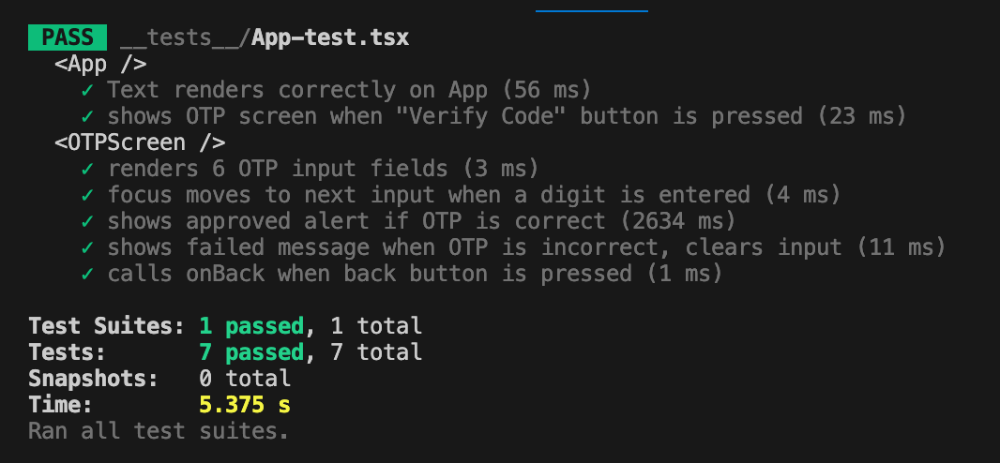
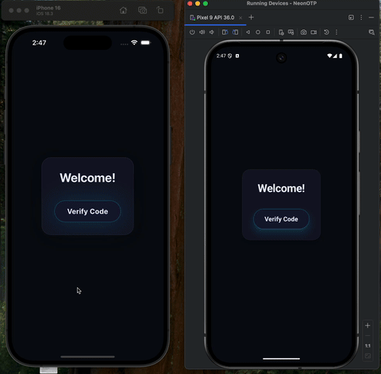

# NeonOTPExpo

A modern, beautiful React Native (Expo) app for OTP (One-Time Password) code entry, featuring a custom OTP input screen and theming system.

## Features
- **Custom OTP Input:** 6-digit OTP entry with auto-focus, validation, and feedback (approved/failed).
- **Modern UI:** Uses a design token-based theme for consistent colors, spacing, and typography.
- **Accessible:** Buttons and inputs are accessible and tested.
- **Test Coverage:** Includes unit and integration tests using Jest and React Native Testing Library.


## Demo

### ✅ All Tests Passing



### 📹 App in Action (GIF)


### 📥 Downloadable Video
[Download MP4 demo](assets/demo.mp4)


## Getting Started

### Prerequisites
- [Node.js](https://nodejs.org/)
- [Yarn](https://yarnpkg.com/) or [npm](https://www.npmjs.com/)
- [Expo CLI](https://docs.expo.dev/get-started/installation/)

### Installation
1. Clone the repository:
   ```sh
   git clone https://github.com/rotembcohen/NeonOTPExpo.git
   cd NeonOTPExpo
   ```
2. Install dependencies:
   ```sh
   npm install
   # or
   yarn install
   ```
3. Start the Expo development server:
   ```sh
   npx expo start
   # or
   yarn expo start
   ```

### Running on Device/Simulator
- Use the Expo Go app on your device, or run on iOS/Android simulator via Expo CLI.

### Running Tests
```sh
npm test
# or
yarn test
```

## Project Structure
- `App.tsx` — Main entry point, handles navigation between welcome and OTP screens.
- `OTPScreen.tsx` — OTP input UI and logic.
- `theme.ts` — Design tokens for colors, spacing, fonts, etc.
- `__tests__/` — Unit and integration tests.
- `assets/` — App icons and images.

## Theming
All colors, radii, shadows, and spacing are defined in `theme.ts` for easy customization.

## License
[MIT](LICENSE)
